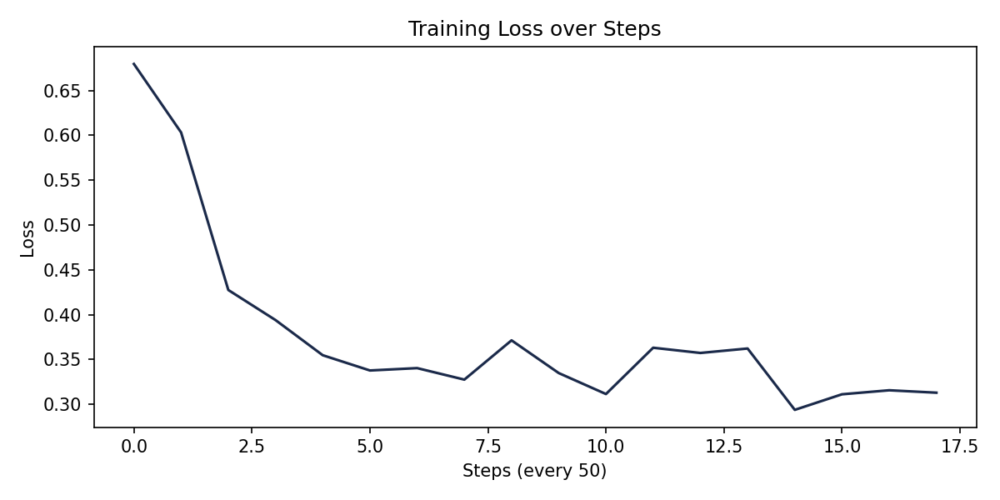
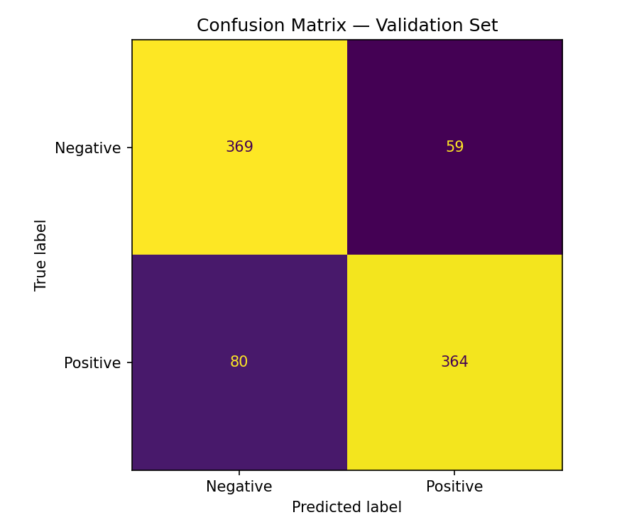

# Sentiment-Guided Fine-Tuning Pipeline

Fine-tuned DistilBERT on SST-2 sentiment data using LoRA, I trained only 1% of the model's parameters on a free Colab GPU and hit 84% F1.

## What I built

Took a pre-trained DistilBERT model and fine-tuned it for positive/negative sentiment classification. The interesting part is using LoRA (Low-Rank Adaptation) and instead of retraining all 67M parameters, you freeze most of the model and only train small adapter layers injected into the attention blocks. Ends up being ~739k trainable parameters instead of 67M, which means the whole thing runs on a free T4 GPU in about 2 minutes.

## Dataset

SST-2 from Stanford via Hugging Face, movie reviews labeled positive or negative. Used 5,000 training samples and 872 for validation. Labels were roughly balanced so no resampling needed.

## Setup

- Base model: `distilbert-base-uncased`
- LoRA: r=8, alpha=16, target layers: q_lin and v_lin
- 3 epochs, batch size 16, Google Colab T4 GPU

## Results

84% macro F1 on the validation set. Loss dropped from 0.67 to 0.31 over training.




## Run it

```bash
pip install -r requirements.txt
python sentiment_finetune.py
```
